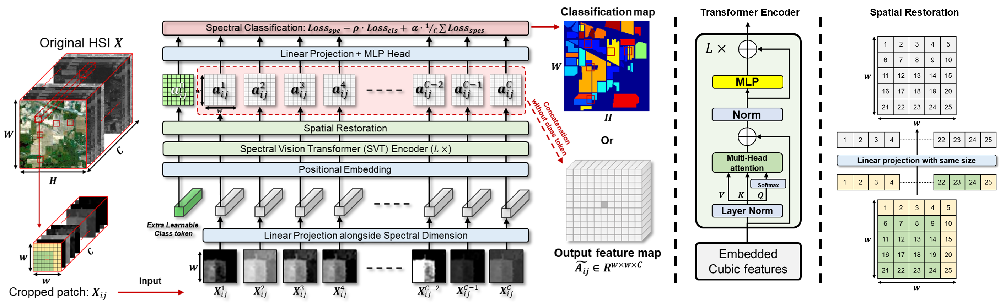

# ICPR_2022
The accepted paper for the 26th International Conference on Pattern Recognition (ICPR2022).

W. Zhou, S. -I. Kamata, Z. Luo and X. Chen, "Hierarchical Unified Spectral-Spatial Aggregated Transformer for Hyperspectral Image Classification," 2022 26th International Conference on Pattern Recognition (ICPR), 2022, pp. 3041-3047, doi: 10.1109/ICPR56361.2022.9956396. (https://ieeexplore.ieee.org/document/9956396)

Spectral branch
-------------------------------
Spectral vision transformer (SVT).

